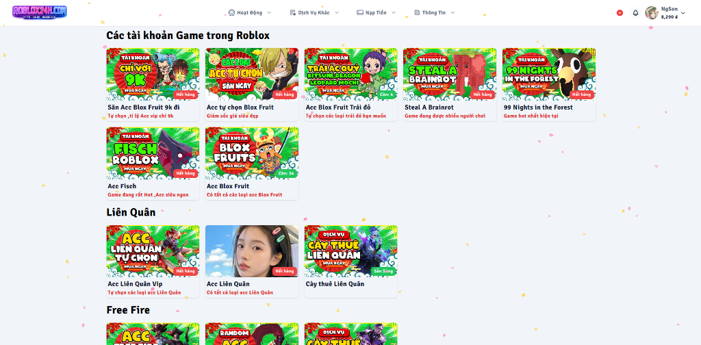

# 🎮 ShopGame – Nền Tảng Mua Bán Tài Khoản & Vật Phẩm Game

> Website thương mại điện tử chuyên biệt cho lĩnh vực game, hỗ trợ mua bán tài khoản, vật phẩm, dịch vụ cày thuê và mini game vòng quay may mắn.

<p align="center">
  
</p>

---

## 📋 Mục Lục

- [Giới thiệu](#-giới-thiệu)
- [Công nghệ sử dụng](#-công-nghệ-sử-dụng)
- [Tính năng chính](#-tính-năng-chính)
- [Cấu trúc dự án](#-cấu-trúc-dự-án)
- [Yêu cầu hệ thống](#-yêu-cầu-hệ-thống)
- [Cài đặt & Triển khai](#-cài-đặt--triển-khai)
- [Cấu hình môi trường](#-cấu-hình-môi-trường)
- [Phân quyền & Vai trò](#-phân-quyền--vai-trò)
- [API Endpoints](#-api-endpoints)
- [Thành viên nhóm](#-thành-viên-nhóm)
- [Giấy phép](#-giấy-phép)

---

## 🎯 Giới Thiệu

**ShopGame (KiyoVN)** là một nền tảng web thương mại điện tử được xây dựng chuyên biệt cho ngành công nghiệp game. Hệ thống cho phép:

- **Mua bán tài khoản game** (Account V1 & V2) với nhiều hình thức hiển thị
- **Giao dịch vật phẩm in-game** (Robux, Kim cương, Quân huy,...)
- **Dịch vụ cày thuê** (Boosting/Grinding Service)
- **Mini game vòng quay** may mắn với phần thưởng đa dạng
- **Hệ thống cộng tác viên & affiliate** giúp mở rộng kinh doanh
- **Thanh toán đa kênh** tích hợp tự động (Banking, Thẻ cào, PayPal, USDT)
- **Hỗ trợ đa ngôn ngữ & đa tiền tệ** cho thị trường quốc tế

---

## 🛠 Công Nghệ Sử Dụng

| Thành phần       | Công nghệ                                    |
|-------------------|-----------------------------------------------|
| **Backend**       | PHP 8.1+, Laravel 10                         |
| **Frontend**      | Vue.js 3, Blade Templates, Alpine.js         |
| **CSS Framework** | TailwindCSS 3 (với Typography & Aspect Ratio)|
| **Build Tool**    | Vite 4                                        |
| **Database**      | MySQL                                         |
| **Authentication**| Laravel Sanctum, Socialite (Google, Facebook, Discord), WebAuthn (Passkey), Google 2FA |
| **Thanh toán**    | Web2M (Auto Banking), Card24h (Thẻ cào), PayPal SDK, USDT (FPayment) |
| **UI Components** | Ant Design Vue 4, Chart.js, ApexCharts, SweetAlert2, FullCalendar |
| **Upload ảnh**    | AWS S3, DigitalOcean Spaces, IMGBB            |
| **Bảo mật**       | WebAuthn/Passkey, 2FA (TOTP), IP Tracking, Security Ban |

---

## ✨ Tính Năng Chính

### 🏠 Trang Chủ (Public)
- Banner quảng cáo (ảnh/video YouTube)
- TOP nạp tiền hàng tháng
- Thông báo chạy ngang & thông báo nổi (modal)
- Lịch sử mua nick trong 24h gần nhất
- Danh mục sản phẩm: Tài khoản V1, V2, Vật phẩm, Cày thuê, Vòng quay

### 👤 Tài Khoản Khách Hàng
- Đăng nhập/Đăng ký qua Google, Facebook hoặc tài khoản thường
- Quên mật khẩu & xác thực email
- Nạp tiền tự động: Auto Banking (Web2M), Thẻ cào (Card24h), PayPal, USDT
- Lịch sử mua hàng (Nick V1, V2, Cày thuê, Vật phẩm)
- Hệ thống Coupon/Mã giảm giá
- Hệ thống Ticket hỗ trợ khách hàng
- Kho vật phẩm & rút thưởng (nhiều loại tiền tệ game)
- Quà tặng ngẫu nhiên cho thành viên mới
- Tiếp thị liên kết (Affiliate Program)
- Bảo mật: Passkey (WebAuthn), Google 2FA, quản lý thiết bị

### 🤝 Cộng Tác Viên (Partner)
- Đăng bán tài khoản vào nhiều nhóm sản phẩm
- CTV Cày thuê & CTV Vật phẩm
- Trang thống kê doanh thu cá nhân
- Yêu cầu rút tiền hoa hồng

### ⚙️ Quản Trị (Admin Dashboard)
- **Thống kê doanh thu** tổng quan với biểu đồ
- **Quản lý sản phẩm**: Danh mục, Nhóm, Gói dịch vụ (Account V1/V2, Boosting, Items)
- **Quản lý đơn hàng**: Theo dõi, duyệt, xử lý đơn hàng tất cả loại
- **Quản lý thành viên**: Cộng/trừ tiền, khóa tài khoản, cập nhật thông tin
- **Cấu hình thanh toán**: Auto Bank, Thẻ cào, PayPal, USDT, PerfectMoney
- **Cấu hình website**: SEO (title, mô tả, keywords), Logo, Footer, Banner
- **Quản lý bài viết/tin tức**
- **Mini game Vòng Quay** may mắn
- **Hệ thống mã giảm giá (Coupon)**
- **Hệ thống thông báo** website & Telegram
- **Quản lý Affiliate**: Duyệt yêu cầu rút tiền, thống kê hoa hồng
- **Quản lý kho hàng & phần thưởng** (tiền tệ game)
- **Hệ thống đa ngôn ngữ**: Quản lý ngôn ngữ, dịch tự động (GTranslate)
- **Hệ thống đa tiền tệ**: Cấu hình tỷ giá, gán tiền tệ theo domain
- **Quản lý multi-domain**: Hỗ trợ nhiều tên miền với cấu hình riêng biệt
- **Hệ thống vai trò & phân quyền** (Role-based Access Control)
- **Email Templates**: Tùy chỉnh mẫu email thông báo
- **Campaign & Promotion**: Quản lý chiến dịch marketing & khuyến mãi
- **System Logs**: Theo dõi nhật ký hệ thống
- **Bảo mật nâng cao**: Security Ban, IP Tracking, WebRTC Detection

---

## 📁 Cấu Trúc Dự Án

```
shop_game/
├── app/
│   ├── Console/              # Artisan Commands & Cron Jobs
│   ├── Exceptions/           # Exception Handlers
│   ├── Helpers/              # Helper functions (Helper.php, Helper2.php)
│   ├── Http/
│   │   ├── Controllers/
│   │   │   ├── Account/      # Controllers tài khoản khách hàng
│   │   │   ├── Admin/        # Controllers quản trị viên
│   │   │   │   ├── Account/  # Quản lý tài khoản V1
│   │   │   │   ├── AccountV2/# Quản lý tài khoản V2
│   │   │   │   ├── Boosting/ # Quản lý cày thuê
│   │   │   │   ├── Game/     # Quản lý mini game
│   │   │   │   ├── Inventory/# Quản lý kho hàng
│   │   │   │   ├── Item/     # Quản lý vật phẩm
│   │   │   │   ├── Service/  # Quản lý danh mục dịch vụ
│   │   │   │   ├── Settings/ # Cài đặt hệ thống
│   │   │   │   └── Staff/    # Quản lý nhân viên
│   │   │   ├── Api/          # REST API Controllers
│   │   │   │   ├── Deposit/  # API nạp tiền (Bank, Card, PayPal, USDT)
│   │   │   │   ├── Store/    # API cửa hàng
│   │   │   │   └── Tools/    # API công cụ tiện ích
│   │   │   ├── Auth/         # Xác thực (Login, Register, Social Login)
│   │   │   ├── Game/         # Mini game (Vòng quay)
│   │   │   ├── Partner/      # Cộng tác viên
│   │   │   ├── Staff/        # Nhân viên
│   │   │   └── Store/        # Cửa hàng (Account V1/V2, Boosting, Items)
│   │   └── Middleware/       # HTTP Middleware
│   ├── Models/               # 67 Eloquent Models
│   ├── Notifications/        # Email & Push Notifications
│   ├── Policies/             # Authorization Policies
│   ├── Providers/            # Service Providers
│   ├── Services/             # Business Logic Services
│   │   ├── CurrencyRateService.php  # Tỷ giá tiền tệ
│   │   ├── KiyoAIService.php        # AI Service
│   │   └── TranslationService.php   # Dịch thuật
│   ├── Traits/               # Reusable Traits
│   └── View/                 # View Composers
├── bootstrap/                # Laravel Bootstrap
├── config/                   # Cấu hình ứng dụng
├── database/
│   ├── factories/            # Model Factories
│   ├── migrations/           # 193 Database Migrations
│   └── seeders/              # Database Seeders
├── lang/                     # Đa ngôn ngữ
├── public/                   # Assets công khai
├── resources/
│   ├── css/                  # Stylesheets
│   ├── js/                   # JavaScript & Vue Components
│   ├── sass/                 # SASS Stylesheets
│   └── views/                # Blade Templates
│       ├── account/          # Giao diện tài khoản
│       ├── admin/            # Giao diện quản trị
│       ├── auth/             # Giao diện xác thực
│       ├── components/       # Blade Components
│       ├── game/             # Giao diện mini game
│       ├── layouts/          # Layout chính
│       ├── pages/            # Trang tĩnh
│       ├── partner/          # Giao diện CTV
│       ├── staff/            # Giao diện nhân viên
│       └── store/            # Giao diện cửa hàng
├── routes/
│   ├── web.php               # Web Routes
│   ├── api.php               # API Routes
│   └── channels.php          # Broadcast Channels
├── storage/                  # File storage & cache
├── tests/                    # Unit & Feature Tests
├── composer.json             # PHP Dependencies
├── package.json              # Node.js Dependencies
├── vite.config.js            # Vite Build Configuration
├── tailwind.config.js        # TailwindCSS Configuration
└── .env.example              # Environment Template
```

---

## 💻 Yêu Cầu Hệ Thống

- **PHP** >= 8.1
- **Composer** >= 2.x
- **Node.js** >= 16.x & **NPM/Yarn**
- **MySQL** >= 8.0
- **Web Server**: Apache hoặc Nginx (có hỗ trợ `.htaccess`)

---

## 🚀 Cài Đặt & Triển Khai

### 1. Clone Repository

```bash
git clone https://github.com/ngdaison/shopgame.git
cd shopgame
```

### 2. Cài đặt Dependencies

```bash
# Cài đặt PHP dependencies
composer install

# Cài đặt Node.js dependencies
npm install
# hoặc
yarn install
```

### 3. Cấu hình môi trường

```bash
# Sao chép file cấu hình mẫu
cp .env.example .env

# Tạo application key
php artisan key:generate
```

### 4. Cấu hình Database

Chỉnh sửa file `.env` với thông tin database của bạn:

```env
DB_CONNECTION=mysql
DB_HOST=127.0.0.1
DB_PORT=3306
DB_DATABASE=shop_game_v1
DB_USERNAME=your_username
DB_PASSWORD=your_password
```

### 5. Chạy Migration

```bash
php artisan migrate
```

### 6. Build Frontend Assets

```bash
# Development
npm run dev

# Production
npm run build
```

### 7. Khởi chạy Server

```bash
php artisan serve
```

Truy cập: `http://localhost:8000`

---

## ⚙ Cấu Hình Môi Trường

### Đăng nhập mạng xã hội (Social Login)

```env
# Google OAuth
GOOGLE_ACTIVE=true
GOOGLE_CLIENT_ID=your_google_client_id
GOOGLE_CLIENT_SECRET=your_google_client_secret
GOOGLE_REDIRECT_URI=https://yourdomain.com/login/google/callback

# Facebook OAuth
FACEBOOK_ACTIVE=true
FACEBOOK_CLIENT_ID=your_facebook_client_id
FACEBOOK_CLIENT_SECRET=your_facebook_client_secret
FACEBOOK_REDIRECT_URI=https://yourdomain.com/login/facebook/callback
```

### Cổng thanh toán

```env
# Cấu hình qua Admin Dashboard > API Config
# - Web2M: Auto Banking
# - Card24h: Thẻ cào tự động
# - PayPal: Thanh toán quốc tế
# - USDT: Thanh toán crypto (FPayment)
# - PerfectMoney: Thanh toán quốc tế
```

### Upload File

```env
# Chọn driver: local, s3, do_spaces, imgbb
FILESYSTEM_DISK=local

# AWS S3
AWS_ACCESS_KEY_ID=
AWS_SECRET_ACCESS_KEY=
AWS_DEFAULT_REGION=us-east-1
AWS_BUCKET=
```

---

## 🔐 Phân Quyền & Vai Trò

Hệ thống sử dụng **Role-based Access Control (RBAC)** với các vai trò chính:

| Vai trò          | Mô tả                                                    |
|-------------------|-----------------------------------------------------------|
| **Admin**         | Toàn quyền quản trị hệ thống                            |
| **Staff**         | Nhân viên hỗ trợ, xử lý đơn hàng & ticket              |
| **Partner (CTV)** | Cộng tác viên, đăng bán tài khoản & dịch vụ             |
| **User**          | Khách hàng, mua hàng & sử dụng dịch vụ                  |

Quản lý phân quyền chi tiết tại: **Admin Dashboard > Quản lý Vai trò**

---

## 📡 API Endpoints

Hệ thống cung cấp REST API cho các tính năng:

| Nhóm API       | Mô tả                                  |
|------------------|------------------------------------------|
| `/api/deposit/*` | Xử lý nạp tiền (Bank, Card, PayPal, USDT) |
| `/api/store/*`   | Dữ liệu cửa hàng & sản phẩm            |
| `/api/order/*`   | Quản lý đơn hàng                         |
| `/api/game/*`    | Mini game (Vòng quay)                    |
| `/api/coupon/*`  | Kiểm tra & áp dụng mã giảm giá          |
| `/api/user/*`    | Thông tin tài khoản người dùng           |
| `/api/tools/*`   | Công cụ tiện ích                         |
| `/api/admin/*`   | API dành cho quản trị viên               |

API được bảo vệ bởi **Laravel Sanctum** (token-based authentication).

---

## 👥 Thành Viên Nhóm

| Thành viên          | Vai trò                    |
|----------------------|----------------------------|
| **Nguyễn Đại Sơn**  | Project Manager / Backend  |
| *(Bổ sung thêm)*    | *(Vai trò)*                |

---

## 📄 Giấy Phép

Dự án này được phát triển phục vụ mục đích học tập và nghiên cứu.  
Sử dụng framework [Laravel](https://laravel.com) - mã nguồn mở theo giấy phép [MIT](https://opensource.org/licenses/MIT).

---

<p align="center">
  <b>ShopGame</b> &copy; 2026 - Built with ❤️ using Laravel & Vue.js
</p>
